<p align="center">
  
</p>

<h1 align="center">SIAGA KARTA</h1>
<p align="center"><strong>Sistem Informasi Pelayanan Warga dan Administrasi Karang Taruna Terintegrasi</strong></p>
<p align="center">
  Pelayanan warga • Ambulans • Pengaduan sosial • Kas & pembayaran • Program sosial • Pelaporan
</p>

<p align="center">
  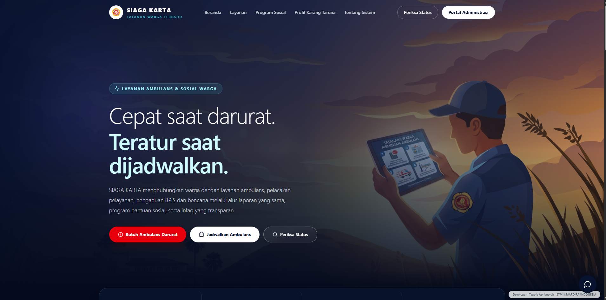
</p>

---

## Tentang SIAGA KARTA

**SIAGA KARTA** adalah sistem informasi berbasis web yang dirancang untuk membantu Karang Taruna mengelola pelayanan warga dalam satu alur yang terintegrasi. Sistem menghubungkan layanan publik untuk warga dengan dashboard operasional untuk **Admin** dan **Petugas Karang Taruna**.

Sistem ini mencakup pengajuan layanan ambulans, pengaduan BPJS, laporan bencana, pelacakan status layanan, pengelolaan kas dan transaksi, pembayaran/infaq melalui QR atau rekening, program sosial, notifikasi, laporan, serta manajemen akun.

Tujuan utama SIAGA KARTA adalah membuat proses pelayanan lebih **jelas, terpantau, terdokumentasi, aman, dan mudah dikelola**.

---

## Fitur Utama

### Untuk Warga

- Mengajukan **ambulans darurat**.
- Menjadwalkan **ambulans terjadwal**.
- Menyampaikan **pengaduan BPJS**.
- Menyampaikan **laporan bencana**.
- Memperoleh kode laporan untuk melacak perkembangan layanan.
- Menggunakan fitur **Periksa Status Layanan**.
- Melihat program sosial Karang Taruna.
- Memberikan dukungan/infaq melalui **QR atau rekening resmi**.
- Mengunggah bukti pembayaran untuk diverifikasi.
- Menggunakan **SiagaBot** untuk memperoleh informasi dasar terkait layanan.

### Untuk Petugas Karang Taruna

- Melihat antrean pelayanan warga.
- Menambahkan permohonan warga yang diterima melalui datang langsung, telepon, atau WhatsApp.
- Memproses dan memperbarui status pelayanan.
- Melakukan penugasan ambulans.
- Memantau ketersediaan unit ambulans.
- Mengelola kas dan transaksi.
- Memverifikasi atau menolak bukti pembayaran.
- Mengelola QR dan rekening pembayaran.
- Melihat notifikasi operasional.
- Mengunduh laporan pelayanan dan keuangan.

### Untuk Admin

Admin memperoleh seluruh fungsi operasional Petugas, ditambah:

- Manajemen pengguna.
- Penambahan dan perubahan unit ambulans.
- Verifikasi administrasi tertentu.
- Pengawasan data dan aktivitas sistem.
- Pemeriksaan kondisi sistem sesuai hak akses Admin.

---

## Alur Sistem

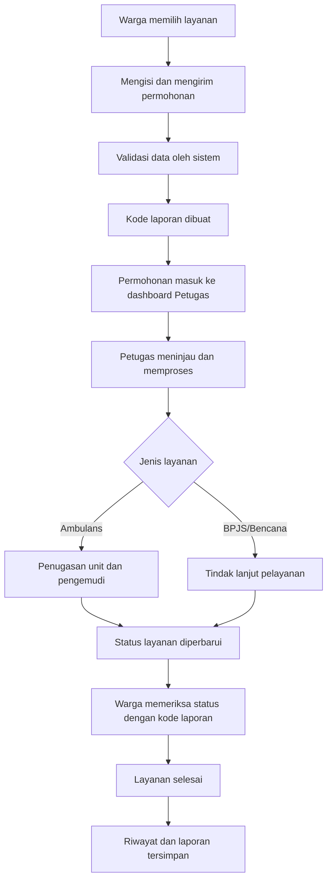
```mermaid
flowchart TD
    A[Warga memilih layanan] --> B[Mengisi dan mengirim permohonan]
    B --> C[Validasi data oleh sistem]
    C --> D[Kode laporan dibuat]
    D --> E[Permohonan masuk ke dashboard Petugas]
    E --> F[Petugas meninjau dan memproses]
    F --> G{Jenis layanan}
    G -->|Ambulans| H[Penugasan unit dan pengemudi]
    G -->|BPJS/Bencana| I[Tindak lanjut pelayanan]
    H --> J[Status layanan diperbarui]
    I --> J
    J --> K[Warga memeriksa status dengan kode laporan]
    K --> L[Layanan selesai]
    L --> M[Riwayat dan laporan tersimpan]
```

Untuk transaksi dan pembayaran:

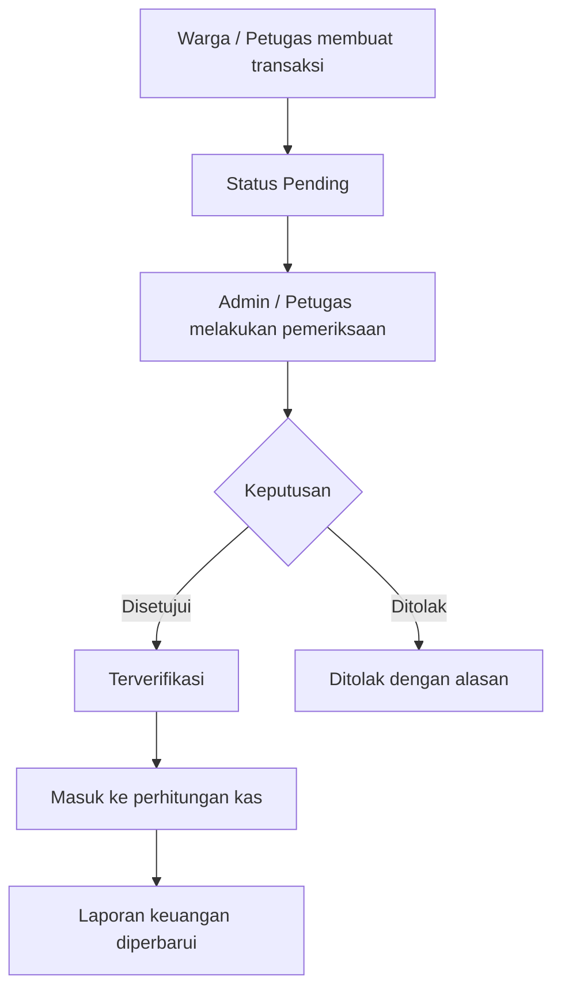
```mermaid
flowchart TD
    A[Warga / Petugas membuat transaksi] --> B[Status Pending]
    B --> C[Admin / Petugas melakukan pemeriksaan]
    C --> D{Keputusan}
    D -->|Disetujui| E[Terverifikasi]
    D -->|Ditolak| F[Ditolak dengan alasan]
    E --> G[Masuk ke perhitungan kas]
    G --> H[Laporan keuangan diperbarui]
```

---

## Hak Akses

SIAGA KARTA menggunakan dua role internal, yaitu **Admin** dan **Petugas Karang Taruna**. Warga tidak memerlukan akun untuk menggunakan layanan publik.

| Fitur | Warga | Petugas Karang Taruna | Admin |
|---|:---:|:---:|:---:|
| Landing page & informasi publik | ✅ | ✅ | ✅ |
| Ajukan pelayanan | ✅ | ✅ | ✅ |
| Periksa status layanan | ✅ | ✅ | ✅ |
| SiagaBot | ✅ | ✅ | ✅ |
| Dashboard internal | ❌ | ✅ | ✅ |
| Pelayanan warga | ❌ | ✅ | ✅ |
| Input permohonan manual | ❌ | ✅ | ✅ |
| Proses penugasan ambulans | ❌ | ✅ | ✅ |
| Melihat data ambulans | Terbatas | ✅ | ✅ |
| Tambah / ubah unit ambulans | ❌ | ❌ | ✅ |
| Kas & transaksi | ❌ | ✅ | ✅ |
| Verifikasi pembayaran | ❌ | ✅ | ✅ |
| QR & rekening pembayaran | Lihat | Kelola | Kelola |
| Unduh laporan | ❌ | ✅ | ✅ |
| Manajemen pengguna | ❌ | ❌ | ✅ |

> Hak akses tidak hanya dibatasi melalui tampilan. Endpoint sensitif juga diperiksa kembali oleh backend berdasarkan permission pengguna.

---

## Cara Penggunaan

### 1. Warga

1. Buka halaman utama SIAGA KARTA.
2. Pilih layanan yang dibutuhkan:
   - Ambulans Darurat
   - Ambulans Terjadwal
   - Pengaduan BPJS
   - Laporan Bencana
3. Lengkapi formulir sesuai kebutuhan layanan.
4. Kirim permohonan.
5. Simpan **kode laporan** yang diberikan sistem.
6. Pilih **Periksa Status** untuk melihat perkembangan pelayanan.
7. Untuk dukungan program/infaq, pilih menu pembayaran dan gunakan QR atau rekening yang ditampilkan.
8. Jika diperlukan, unggah bukti pembayaran agar dapat diverifikasi Petugas.

### 2. Petugas Karang Taruna

1. Buka **Portal Administrasi**.
2. Login menggunakan akun Petugas.
3. Dashboard menampilkan ringkasan pelayanan, ambulans, kas, transaksi, dan notifikasi.
4. Buka **Pelayanan Warga** untuk melihat permohonan yang masuk.
5. Pilih **Detail** untuk melihat informasi permohonan.
6. Gunakan **Proses Penugasan** untuk layanan ambulans.
7. Perbarui status layanan sesuai kondisi pelayanan di lapangan.
8. Buka **Kas & Pembayaran** untuk mengelola transaksi dan melakukan verifikasi pembayaran.
9. Gunakan **Pengaturan Pembayaran** untuk memperbarui QR, bank, nomor rekening, dan pemilik rekening.
10. Buka **Unduh Laporan** untuk memperoleh laporan pelayanan atau laporan keuangan.

### 3. Admin

Admin menggunakan portal yang sama dengan Petugas, tetapi memperoleh hak administrasi tambahan.

Admin dapat:

1. Memantau seluruh aktivitas melalui dashboard.
2. Menangani pelayanan warga.
3. Mengelola unit ambulans.
4. Mengelola kas, transaksi, QR, dan rekening pembayaran.
5. Mengunduh laporan.
6. Membuka **Manajemen Pengguna** untuk membuat, mengubah, mengaktifkan, atau menonaktifkan akun Admin/Petugas.

---

## Status Pelayanan

Untuk layanan ambulans, status utama mengikuti urutan:

```text
Menunggu → Diproses → Dijemput → Selesai
```

Pada kondisi tertentu, layanan dapat ditolak sebelum tahapan pelayanan berlanjut.

Untuk pengaduan BPJS dan laporan bencana:

```text
Menunggu → Diproses → Selesai
```

Riwayat perubahan status disimpan sehingga proses pelayanan dapat ditelusuri kembali.

---

## Kas, Pembayaran, dan Transparansi

SIAGA KARTA memisahkan transaksi menjadi **pemasukan** dan **pengeluaran**.

Saldo sistem tidak diedit secara manual. Nilai saldo berasal dari transaksi yang sudah terverifikasi:

```text
Saldo = Pemasukan Terverifikasi - Pengeluaran Terverifikasi
```

Fitur keuangan mencakup:

- Pemasukan dan pengeluaran.
- Status transaksi Pending, Terverifikasi, atau Ditolak.
- Verifikasi bukti pembayaran.
- QR pembayaran.
- Nomor rekening resmi.
- Nama pemilik rekening.
- Laporan kas dan transaksi.
- Program sosial dan pencatatan bantuan.

---

## Keamanan Sistem

SIAGA KARTA dirancang dengan beberapa lapisan keamanan dan reliabilitas:

- **Role-Based Access Control** untuk membatasi hak Admin dan Petugas.
- Pemeriksaan permission pada backend, bukan hanya menyembunyikan tombol pada frontend.
- Password disimpan dalam bentuk hash.
- Username dan email dinormalisasi agar perilaku login konsisten.
- Rate limiting berlapis untuk mengurangi risiko brute-force login.
- Token sesi memiliki masa aktif dan dapat dicabut ketika akun dinonaktifkan atau password diganti.
- Sinkronisasi logout antar-tab tanpa menyimpan token secara permanen di `localStorage`.
- Data sensitif seperti NIK dan nomor telepon memiliki perlindungan enkripsi/fingerprint.
- Dokumen sensitif seperti KTP dan bukti pembayaran disimpan sebagai file privat.
- Validasi tipe dan ukuran file upload.
- Audit log untuk aktivitas penting.
- Request ID untuk membantu penelusuran masalah.
- Database transaction dan locking pada operasi yang sensitif terhadap perubahan bersamaan.
- Idempotency untuk mengurangi risiko data ganda akibat klik ganda atau request ulang.
- Security headers seperti CSP, HSTS pada HTTPS, X-Frame-Options, dan X-Content-Type-Options.
- Pesan error internal tidak ditampilkan langsung kepada pengguna.

---

## Sinkronisasi Data

Dashboard menggunakan mekanisme **near-real-time synchronization** yang ringan.

Frontend tidak memuat seluruh data secara terus-menerus. Sistem hanya melakukan pemeriksaan revision/signature secara berkala. Jika terdapat perubahan, modul terkait akan diperbarui.

Pendekatan ini menjaga aplikasi tetap responsif tanpa melakukan polling data besar secara berlebihan.

---

## SiagaBot

SiagaBot merupakan asisten informasi ringan pada landing page. Bot dapat membantu menjawab kebutuhan dasar seperti:

- Ketersediaan ambulans.
- Informasi status layanan.
- Informasi BPJS.
- Informasi laporan bencana.

<p align="center">
  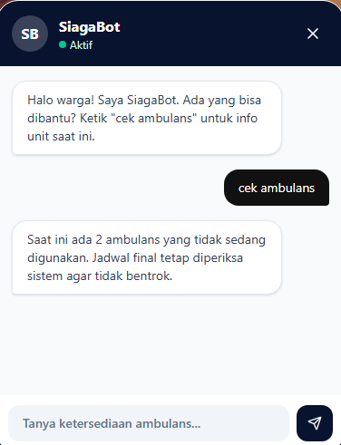
</p>

---

## Teknologi

- **Laravel 12** - Backend dan REST API.
- **React** - Antarmuka pengguna.
- **MySQL** - Database utama.
- **Vite** - Build frontend.
- **Apache** - Web server pada container aplikasi.
- **Docker & Docker Compose** - Deployment aplikasi.
- **Laravel Scheduler** - Pemeliharaan otomatis.
- **Cloudflare Tunnel** - Opsional untuk akses HTTPS dari internet.

---

## Menjalankan dengan Docker

### Persyaratan

- Docker Desktop / Docker Engine.
- Docker Compose.
- Git.

### 1. Clone repository

```bash
git clone <URL-REPOSITORY-ANDA>
cd SiagaKarta
```

### 2. Siapkan konfigurasi environment

```bash
cp .env.docker.example .env
```

Isi nilai penting pada `.env`, terutama key aplikasi, fingerprint key, password database, URL aplikasi, dan konfigurasi proxy sesuai environment deployment.

### 3. Build dan jalankan container

```bash
docker compose up -d --build
```

### 4. Periksa container

```bash
docker compose ps
```

Pastikan service utama dalam kondisi berjalan/healthy.

### 5. Buka aplikasi

Gunakan port yang ditentukan melalui `APP_PORT`, contoh:

```text
http://localhost:8090
```

---

## Akun Demo

Jika project dijalankan dengan:

```env
DEMO_MODE=true
```

akun demo akan disediakan untuk pengujian:

| Peran | Username | Password |
|---|---|---|
| Admin | `admin` | `Rajawali21` |
| Petugas Karang Taruna | `petugas` | `Rajawali21` |

> **Penting:** kredensial di atas hanya untuk demo. Sebelum digunakan pada sistem nyata, nonaktifkan `DEMO_MODE`, gunakan password unik yang kuat, dan jangan mempertahankan kredensial demo pada production.

---

## Dokumentasi Tampilan

### Landing Page

<p align="center">
  
</p>

<p align="center">
  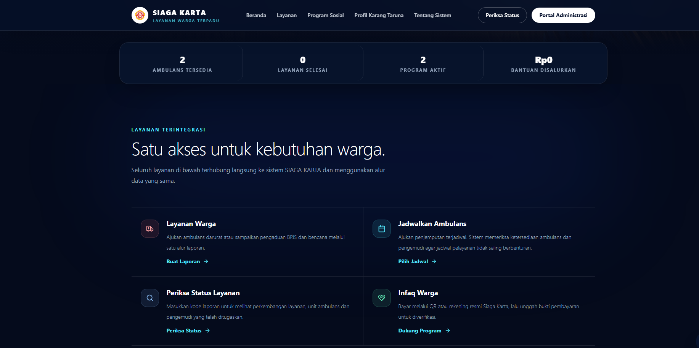
</p>

<p align="center">
  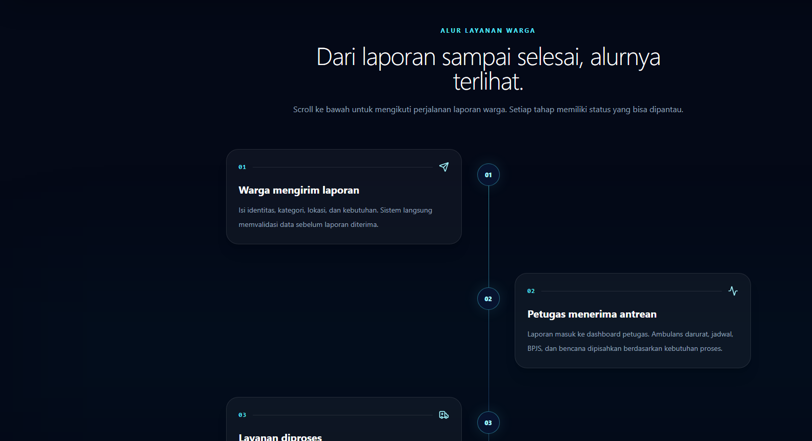
</p>

<details>
<summary><strong>Lihat dokumentasi landing page lainnya</strong></summary>

### Program Sosial

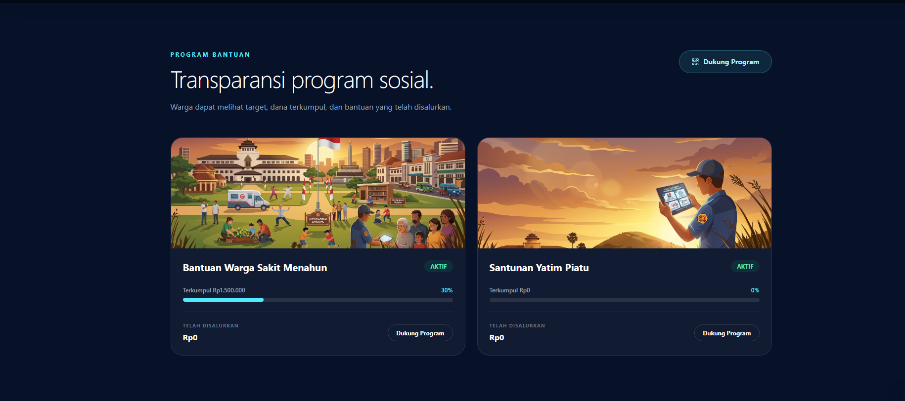

### Profil Karang Taruna Kota Bandung

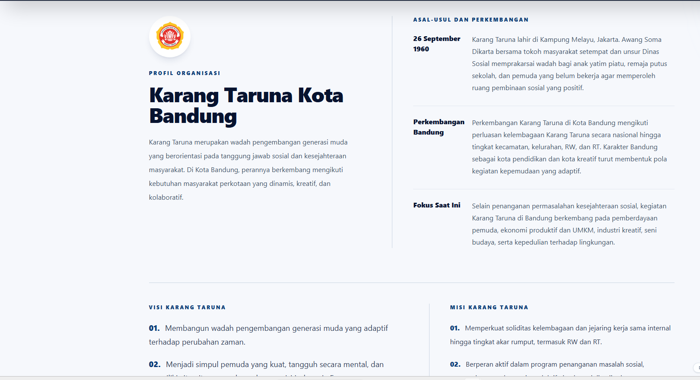

### Tentang Sistem

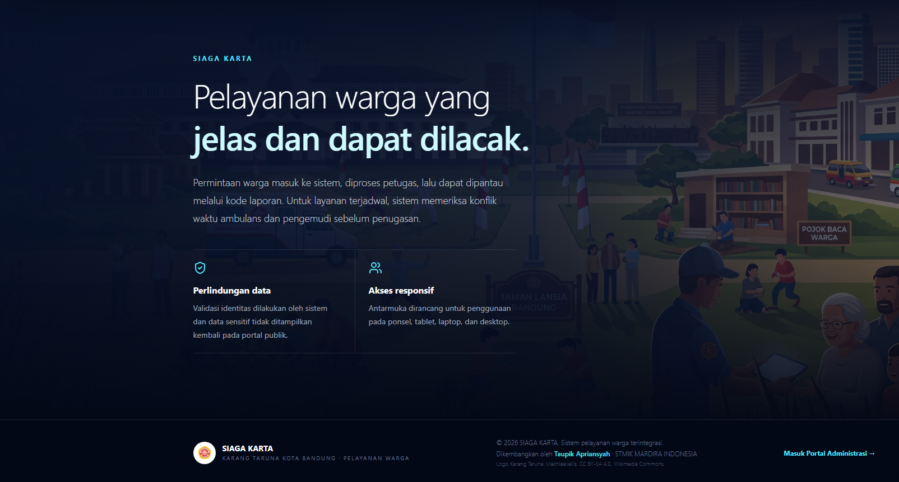

</details>

### Dashboard Admin

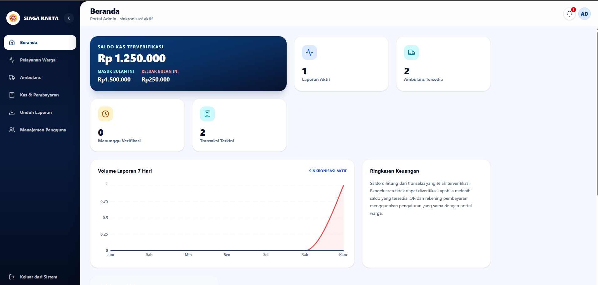

<details>
<summary><strong>Lihat dokumentasi fitur Admin</strong></summary>

### Pelayanan Warga

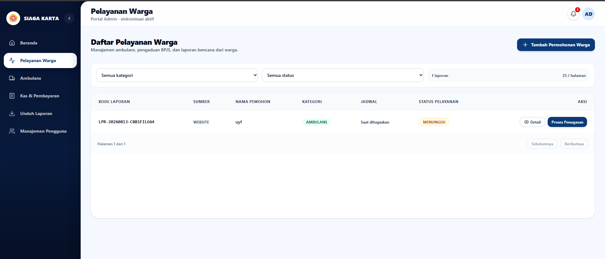

### Input Permohonan Warga

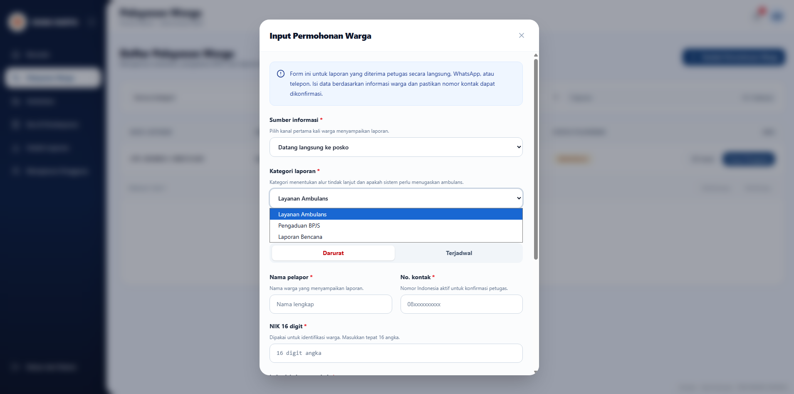

### Tambah Unit Ambulans

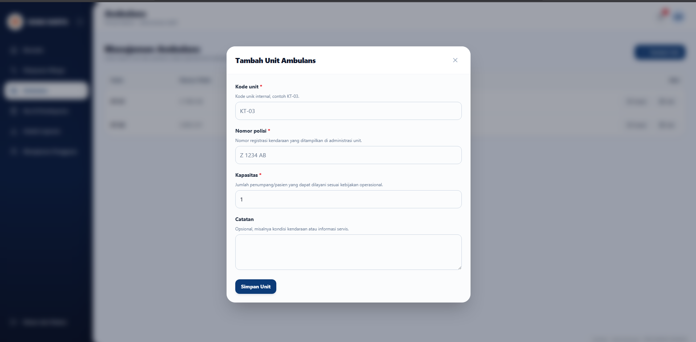

### Manajemen Ambulans

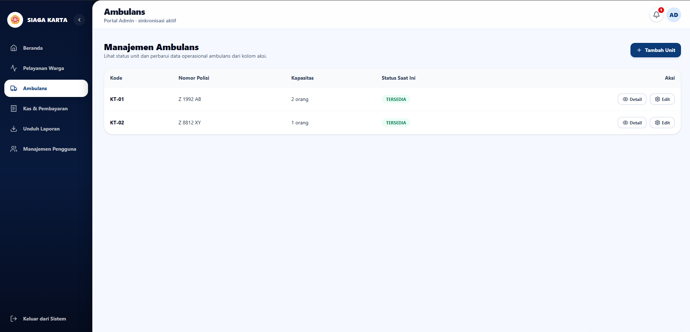

### Kas dan Transaksi

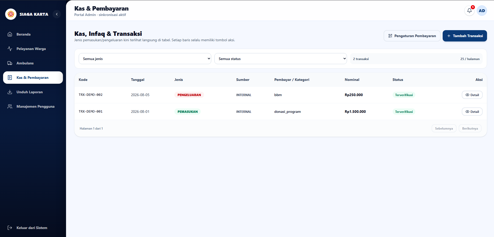

### Tambah Transaksi

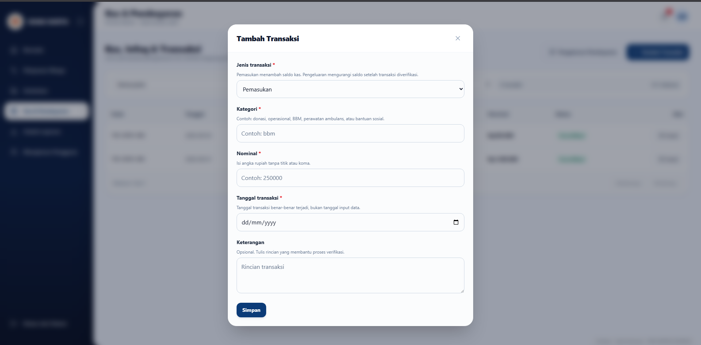

### Pengaturan Pembayaran

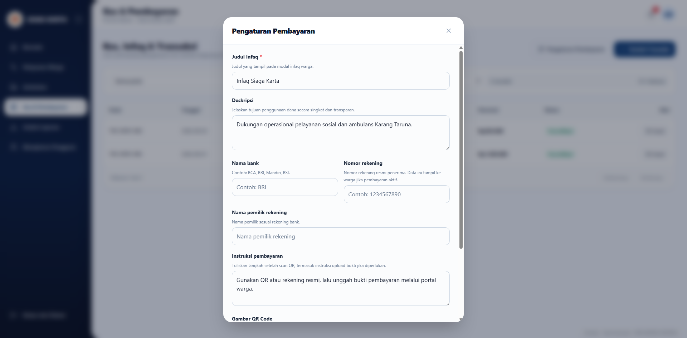

### Unduh Laporan

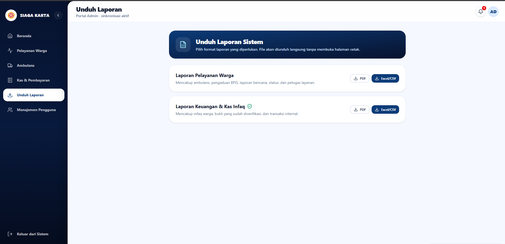

### Manajemen Pengguna

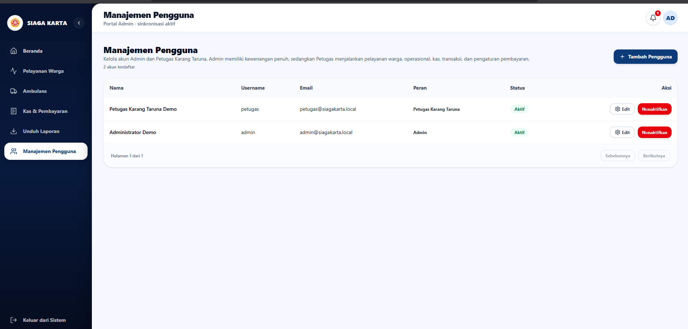

</details>

### Dashboard Petugas Karang Taruna

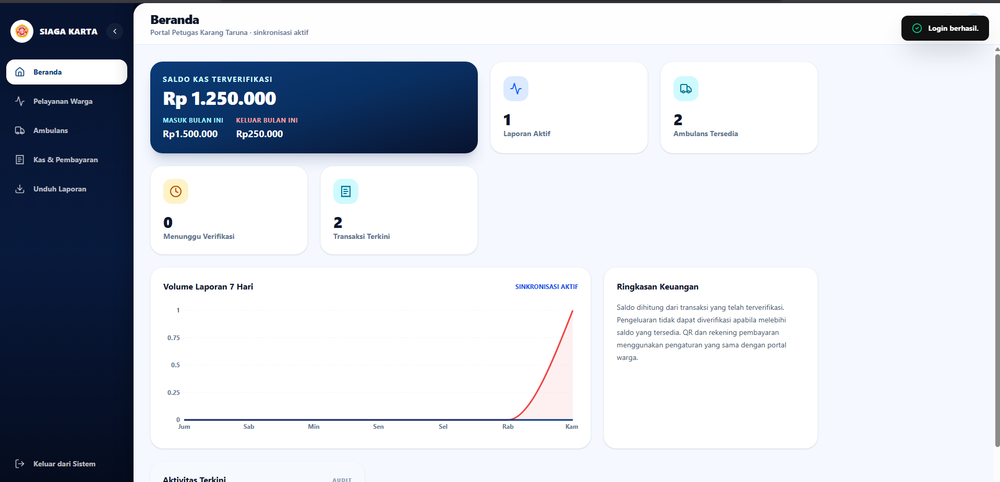

<details>
<summary><strong>Lihat dokumentasi fitur Petugas</strong></summary>

### Pelayanan Warga Petugas

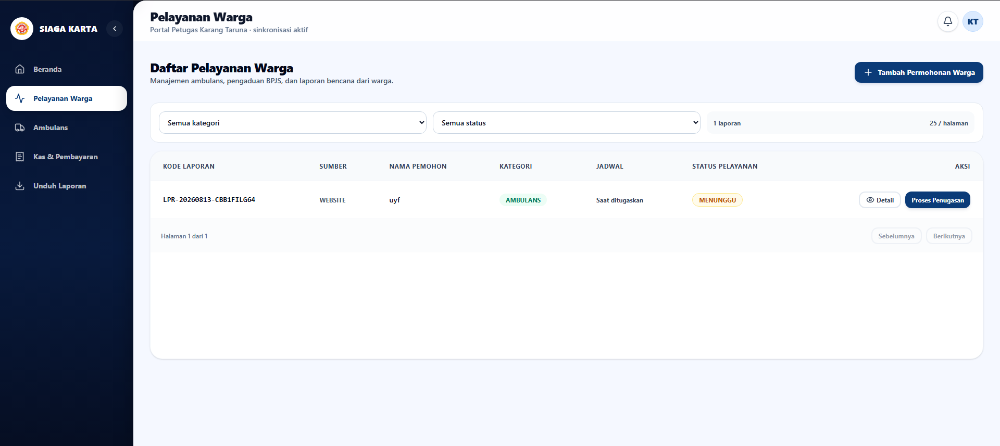

### Ambulans Petugas

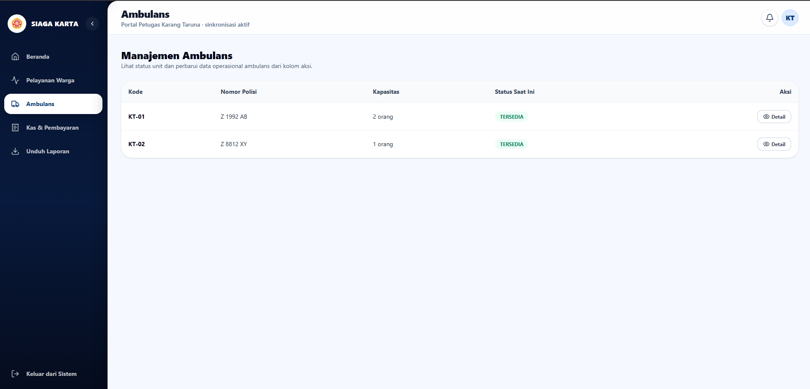

### Detail Unit Ambulans

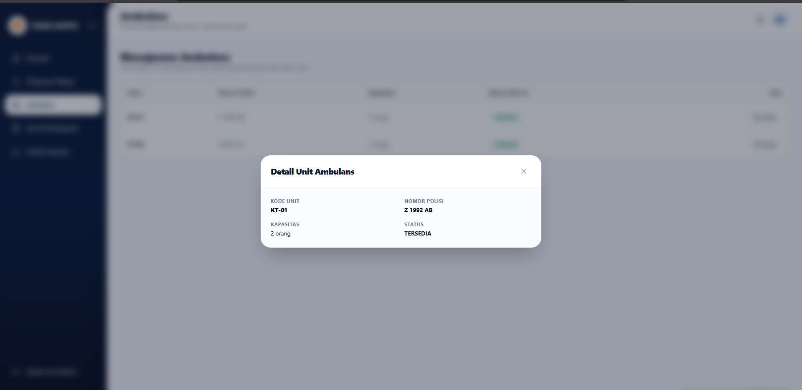

</details>

---

## Catatan Deployment Production

Sebelum digunakan di lingkungan nyata:

- Set `APP_ENV=production`.
- Set `APP_DEBUG=false`.
- Set `DEMO_MODE=false`.
- Gunakan HTTPS.
- Gunakan password database dan secret yang kuat.
- Pastikan `APP_KEY` dan `DATA_FINGERPRINT_KEY` tersimpan dengan aman dan persisten.
- Batasi trusted proxy hanya ke proxy yang benar-benar digunakan.
- Lakukan backup database dan private storage secara rutin.
- Uji proses restore backup.
- Jangan menyimpan file `.env` ke repository publik.

---

## Dokumentasi Tambahan

Repository juga dapat menyertakan dokumentasi teknis berikut:

- `SECURITY.md` - catatan keamanan dan konfigurasi production.
- `CLOUDFLARE_DEPLOY.md` - panduan akses melalui Cloudflare Tunnel.
- `WINDOWS_DOCKER_FIX.md` - catatan troubleshooting Docker pada Windows.
- `REVISION_NOTES_2026-08-12.md` - riwayat revisi teknis sistem.

---

## Pengembang

**Taupik Apriansyah**  
STMIK MARDIRA INDONESIA  
GitHub: [TaupikApriansyah](https://github.com/TaupikApriansyah)

---

<p align="center">
  <strong>SIAGA KARTA</strong><br>
  Sistem pelayanan warga terintegrasi untuk Karang Taruna.
</p>
